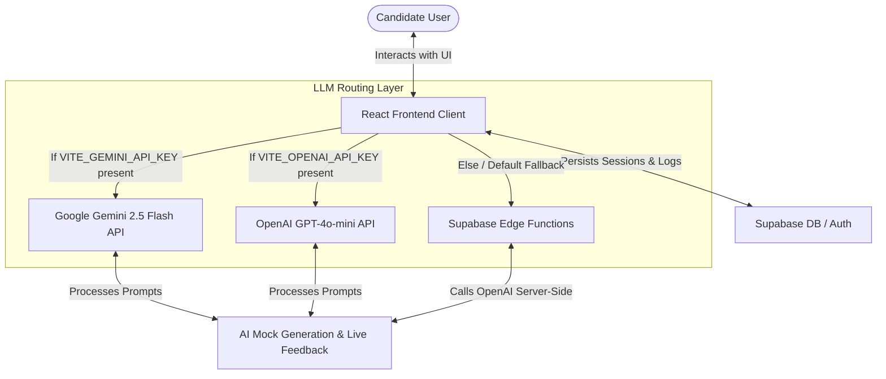

# Project Report: Kairós
**AI-Powered Interview Simulator**

---

## 1. Application Overview & Tech Stack

Kairós is a responsive web application that prepares job seekers for interviews through real-time mock simulation. It extracts professional profiles from résumés, generates custom behavioral and technical questions, and conducts interactive mock interviews with streaming AI feedback.

### Tech Stack
- **Frontend Framework:** React 18 with TypeScript (compiled via Vite)
- **Styling:** Vanilla CSS & Tailwind CSS (version 3.4.1)
- **Database & Auth:** Supabase (PostgreSQL database, anonymous user token tracking, database session management)
- **LLM Integrations:** 
  - **Google Gemini 2.5 Flash** (via Google AI Studio, chosen as the primary 100% free developer tier)
  - **OpenAI GPT-4o-mini** (client-side backup fallback)
  - **Supabase Edge Functions** (server-side proxy fallback)

---

## 2. Prompting Strategy & Frameworks

The core intelligence of Kairós lies in a modular, chained prompting strategy that passes context down from phase to phase.

### Prompt Chaining Pipeline
1. **Extraction Prompt:** Reads raw text and structures it into metadata (hard skills, soft skills, experience, gaps).
2. **Generation Prompt:** Consumes the structured metadata to produce custom behavioral and technical questions.
3. **Roleplay Prompt:** Uses the profile and questions to construct a system prompt for the mock interviewer.

### Sample System Prompts

#### A. Résumé Parser & Gap Analysis Prompt
```text
You are an AI assistant specialized in parsing professional résumés. Your task is to extract information and return a structured JSON profile. Compare the resume to the job description if provided to identify gaps. You must respond with a JSON object matching this structure:
{
  "hard_skills": string[],
  "soft_skills": string[],
  "experience_years": number,
  "summary": "brief summary",
  "gaps": string[]
}
```

#### B. Interview Question Generator Prompt (STAR Framework)
```text
You are an expert technical recruiter and hiring manager. Your task is to generate exactly 5 behavioral questions (based on the STAR methodology: Situation, Task, Action, Result) and exactly 5 technical/role-specific questions. Return a JSON object matching this structure:
{
  "behavioral": [
    { "question": string, "rationale": string, "target_skill": string }
  ],
  "technical": [
    { "question": string, "rationale": string, "target_skill": string }
  ]
}
```

#### C. Live Chat Interviewer Prompt
```text
You are Kairós, a professional, constructive, and encouraging AI Hiring Manager conducting a live mock interview.
Here is the candidate's profile: [extracted JSON profile]
Here are the predicted interview questions for this session: [predicted JSON questions]

Conduct the interview step-by-step:
1. Introduce yourself and set the stage based on the candidate's profile. Ask the first question.
2. In subsequent turns, review the candidate's response. Provide extremely brief, encouraging, and constructive feedback (highlighting strong points or key missing terms/concepts), and then transition to the next question.
3. Ask exactly one question at a time. Keep your messages professional, concise, and conversational.
```

---

## 3. Phase-by-Phase Development Summary

- **Phase 1: Project Setup & Initialization**
  - Generated the React TypeScript application with Vite.
  - Initialized Tailwind CSS and designed the HSL color palette.
- **Phase 2: Database Schema & Supabase Configuration**
  - Setup tables for `interview_sessions` to track resume metadata, questions, and session progress.
  - Implemented owner token persistence in browser local storage.
- **Phase 3: Frontend Component Implementation**
  - Developed the layout: Résumé Input Stage, Briefing Stage, and Live Interview Chat Panel.
  - Built streaming animations, feedback scorecards, and custom load indicators.
- **Phase 4: API Quota Resolution & Multi-LLM Routing**
  - Added support for Google Gemini 2.5 Flash and client-side OpenAI fallbacks to address Supabase Edge Function quota errors.
- **Phase 5: Styling, Polishing & AWS Deployment**
  - Configured project paths in `tailwind.config.js` to enable styling on root files.
  - Linked GitHub to AWS Amplify Hosting for automatic CI/CD deployment.

---

## 4. Application Architecture



---

## 5. Challenges Encountered & Resolutions

### Challenge 1: White Screen & Hardcoded Built Assets in Development
- **Symptoms:** The app failed to boot on the Vite dev server, showing a white page with asset loading errors (`Pre-transform error: Failed to load url /assets/index-nsSBohA1.js`).
- **Resolution:** We discovered that `index.html` was referencing pre-built production scripts. We changed the script tag to point directly to the source entry point `/main.tsx`, resolving the compilation and boot loop.

### Challenge 2: Styling Missing on UI Components
- **Symptoms:** Tailwind utility classes were completely ignored; components rendered as plain, unstyled HTML.
- **Resolution:** The `tailwind.config.js` `content` configuration scanned only the non-existent `./src/` folder. Since all files were in the root directory, we updated the paths to scan `./*.{js,ts,jsx,tsx}`, triggering Tailwind to compile all styles successfully.

### Challenge 3: Supabase OpenAI API Quota Exhausted (Error 429)
- **Symptoms:** When attempting to run resume extraction, the app returned a `429: insufficient_quota` error due to depleted funds on the shared Supabase Edge Function key.
- **Resolution:** We refactored `ai.ts` and `App.tsx` to support client-side API overrides. We integrated **Google Gemini 2.5 Flash** (a 100% free developer tier model) as the primary fallback and added custom prompts directly in the frontend, enabling users to run the entire app for free using a `VITE_GEMINI_API_KEY`.

---

## 6. Key Learnings & Reflections
- **Flexible API Fallbacks:** Building applications that rely on third-party APIs requires resilient fallback strategies. Adding client-side routing to alternative LLMs (Gemini/OpenAI) ensures the application remains functional even when default server credits are exhausted.
- **Tailwind Scanner Accuracy:** Tailwind relies entirely on static scanning. Storing source code in the root directory instead of the conventional `src` folder requires immediate config updates to prevent layout breaks.
- **Secure Deployment Configuration:** Separating code files from environment configurations prevents key exposure. Deploying via AWS Amplify while maintaining keys in secure dashboard variables represents best-practice secure cloud architecture.
